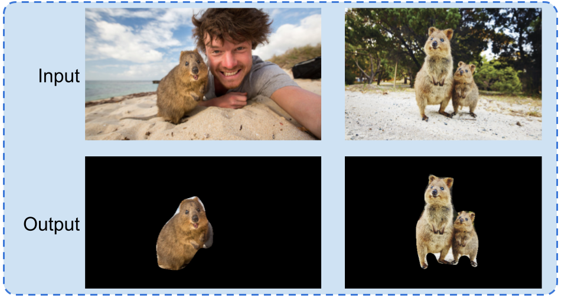

# Deep Object Co-Segmentation (DOCS) - PyTorch

This is the **Pytorch** implementation of our paper **Deep Object Co-Segmentation** published at ACCV18. For more information, you can visit the [project page](https://ohosseini.github.io/projects/DOCS/). You can also find our **caffe** version [here](https://github.com/ohosseini/DOCS-caffe).


## Requirements

- Python 3
- Pytorch >= 1.0
- gcc (tested with gcc 8)

Tested on *Ubuntu 20.04* with *pytorch 1.5*, *CUDA 10.2* and *gcc 8.0* .

NOTE: for using it with older version of pytorch (0.4.1) please check [v1.0](https://github.com/ohosseini/DOCS-pytorch/tree/v1.0) .

## Installation

```console
git clone https://github.com/ohosseini/DOCS-pytorch.git
cd DOCS-pytorch
bash install.sh
```

## Demo

First download the model from [here](https://drive.google.com/file/d/190CYTeTm9HABE59F75QCUG-OLWi_T6VH/view?usp=sharing) and put it in ```DOCS-pytorch``` directory.

Then you can run the demo with

```console
bash demo.sh
```



For more information on how to apply the demo on other images you can check

```console
python demo.py --help
```

## Comparision with Caffe version

The numbers are compareable to the original ones in the paper which are generated using our main code ([DOCS-caffe](https://github.com/ohosseini/DOCS-caffe)).

<center>
<table style="text-align:center;">
  <tr>
    <th></th>
    <th></th>
    <th>DOCS-caffe</th>
    <th>DOCS-pytorch</th>
  </tr>
  <tr>
    <td rowspan="2">MSRC</td>
    <td>P</td>
    <td>95.4</td>
    <td>92.0</td>
  </tr>
  <tr>
    <td>J</td>
    <td>82.9</td>
    <td>82.3</td>
  </tr>
  <tr>
    <td rowspan="2">Internet</td>
    <td>P</td>
    <td>93.5</td>
    <td>92.9</td>
  </tr>
  <tr>
    <td>J</td>
    <td>72.6</td>
    <td>72.0</td>
  </tr>
  <tr>
    <td rowspan="2">iCoseg</td>
    <td>P</td>
    <td>95.1</td>
    <td>94.1</td>
  </tr>
  <tr>
    <td>J</td>
    <td>84.2</td>
    <td>84.0</td>
  </tr>
</table>
</center>

## Citation

If you use this code, please cite our publication:

**Deep Object Co-Segmentation**, Weihao Li*, Omid Hosseini Jafari*, Carsten Rother, *ACCV 2018*.

```
@InProceedings{DOCS_ACCV18,
  title={Deep Object Co-Segmentation},
  author={Li, Weihao and Hosseini Jafari, Omid and Rother, Carsten},
  booktitle={ACCV},
  year={2018}
}
```

## Acknowledgments

We used the Pytorch implementation of correlation layer from "Pytorch implementation of FlowNet 2.0" [https://github.com/NVIDIA/flownet2-pytorch](https://github.com/NVIDIA/flownet2-pytorch).